# terraform-stuff

<p align="center">
  
</p>

<p align="center">
  
   6.0">
  
  
</p>

Terraform code for AWS, applied against [floci](https://floci.io), a local AWS emulator that runs in Docker, instead of a real account. Nothing here costs anything to create or destroy.

## How the load-balanced project fits together

<p align="center">
  
</p>

Terraform talks to floci's AWS API on `localhost:4566`. Floci starts each EC2 instance as a Docker container and runs a real listener for the load balancer, so a request to the load balancer's DNS name is forwarded to one of the instances.

## Run it

You need Docker, Terraform and `make`.

```sh
make aws                 # start floci: AWS API on :4566, web UI on :4500
cd ec2-launch-template
terraform init
terraform apply
```

On floci 2.1.0 the load balancer can't reach its instances until the emulator is attached to the Docker network it creates for the VPC ([floci issue #3846](https://github.com/floci-io/floci/issues/3846)). After `terraform apply`, run:

```sh
docker network connect floci-vpc-4566-ap-south-1-vpc-default-ap-south-1 floci-aws
```

Then open the `alb_dns_name` from the Terraform output. When you're done:

```sh
terraform destroy
make aws-down
```

Deploy one project at a time: they all share one emulated VPC, so resource names can clash.

Floci runs in persistent storage mode with its data in the `floci-data` Docker volume, so S3 buckets (including Terraform state) survive `make aws-down` and a reboot. To start from an empty emulator, run `docker volume rm floci-data` after `make aws-down`.

## License

[Apache License 2.0](LICENSE)
